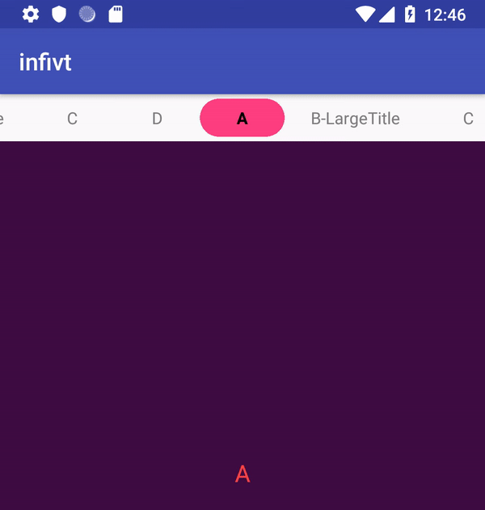
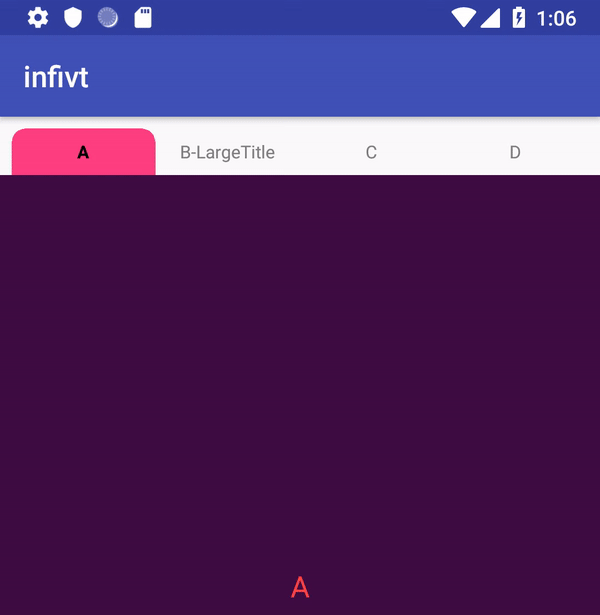

# infivt
infinite Viewpager with Recycler Tablayout and cached Fragment

Reference:[RecyclerTabLayout](https://github.com/nshmura/RecyclerTabLayout),[InfiniteViewPager](https://github.com/antonyt/InfiniteViewPager)

## Demos
infinite demo:


screen fix partial rect demo:


## How to use
root build.gradle


```
allprojects {
    repositories {
        maven { url "https://jitpack.io" }
    }
}
```

app build.gradle

```
implementation 'com.github.cuichanghao:infivt:<last commit Id>'
```
